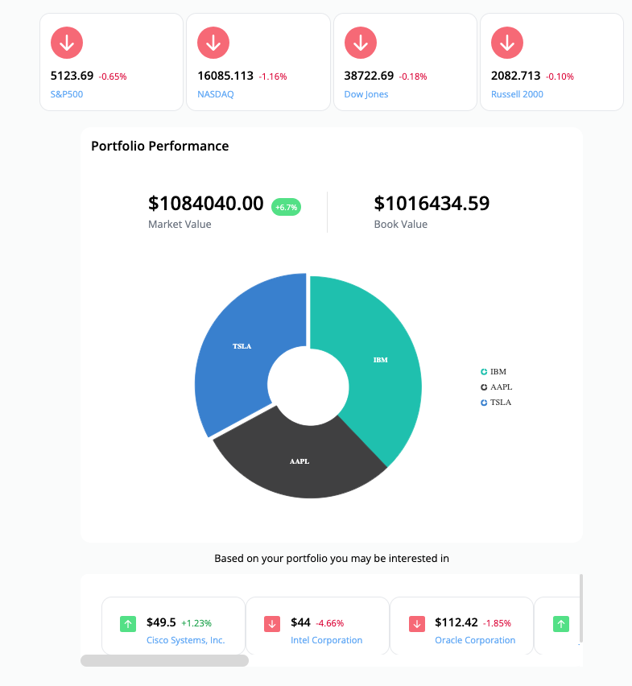
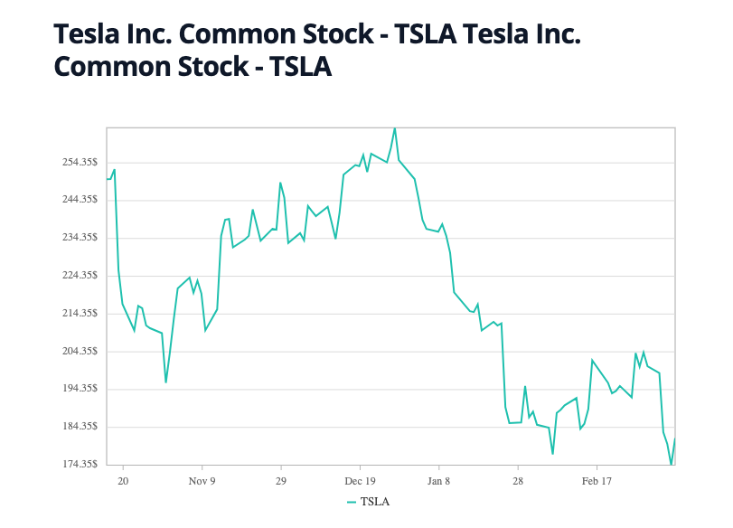
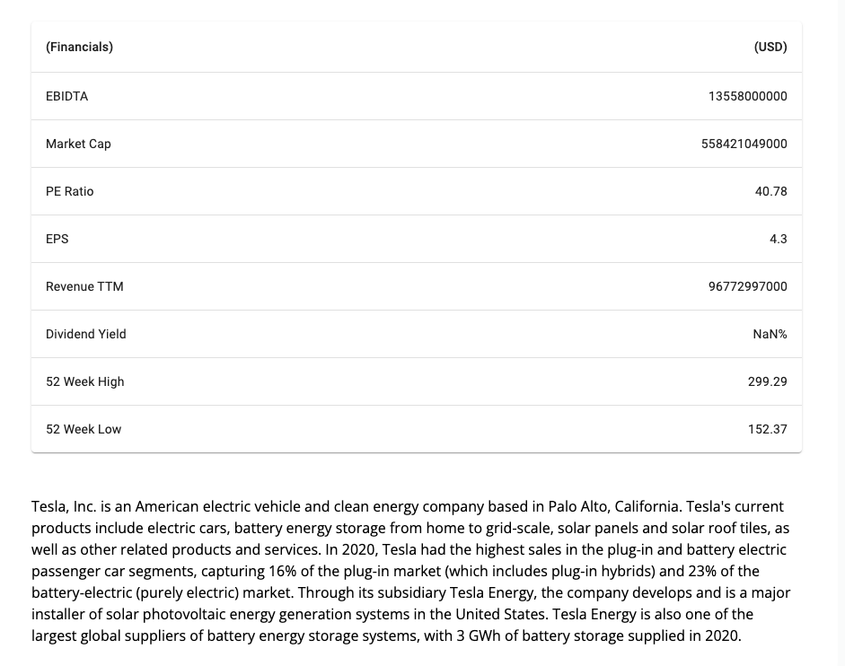
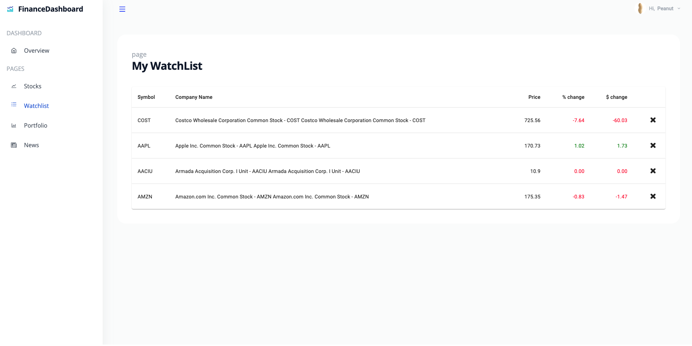
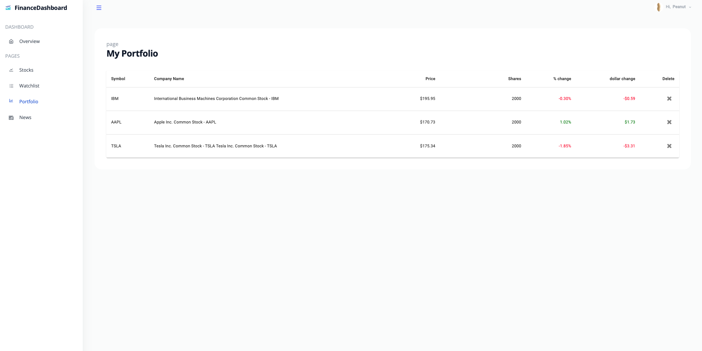
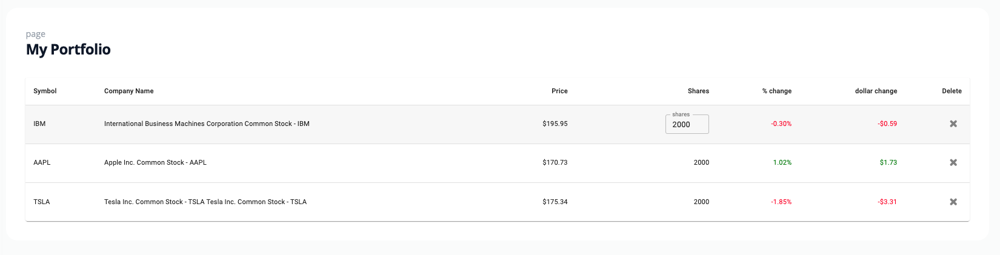
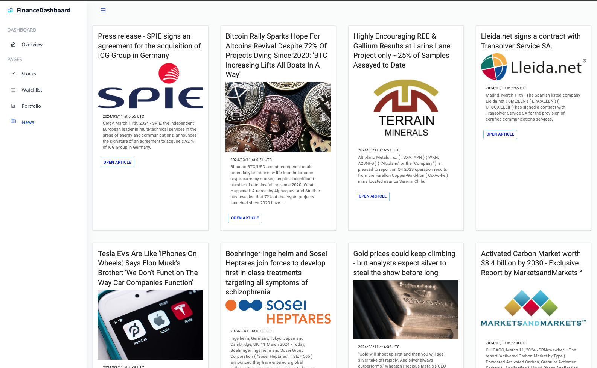

# Financial Dashboard

A fullstack web application to stay up to date on latest market movements and track your investment portfolio.







<!--  -->




## Made with ❤️ using

- [React.js](https://react.dev/)
- [Express.js](https://expressjs.com/)
- [AlphaVantage API](https://www.alphavantage.co/documentation/)
- [Yahoo-Finance2](https://www.npmjs.com/package/yahoo-finance2)
- [Tailwind](https://tailwindcss.com/)
- [Material UI](https://mui.com/material-ui/)
- [Syncfusion](https://www.syncfusion.com/react-components)

## How to Use

### Install dependencies

```bash
npm install
```

### Run the development server

```bash
npm run start
```

### Install client dependencies

```bash
cd client
npm install
```

### Run the client

```bash
npm run start
```
